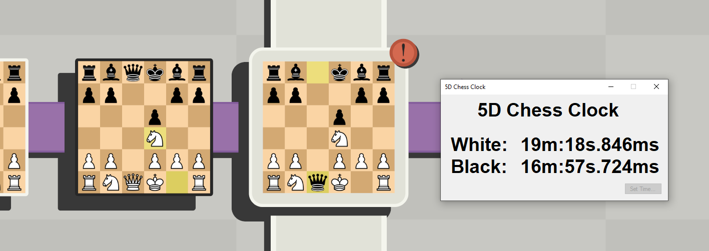
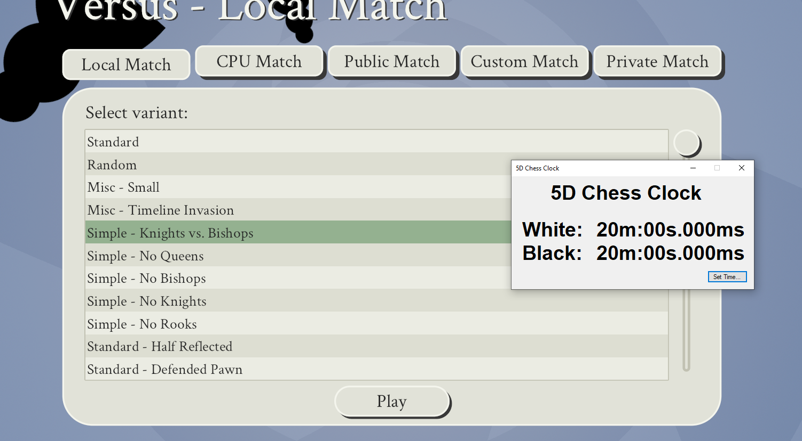
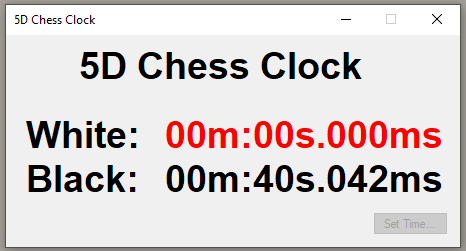

# 5D Chess With Multiverse Time Travel Chess Clock

A simple Windows-Forms chess clock, which automatically starts ticking down when a game is started, and automatically switches between players when the turns are submitted.

Makes use of the unofficial [5D Chess With Multiverse Time Travel Data Interface](https://github.com/GHXX/FiveDChessDataInterface/tree/master).

# Screenshots

The following image shows the clock during a game, the game window being a separate window, not embedded into the 5D chess process.

When there is no game being played currently, the times are reset to their starting value, and the button in the bottom right corner allows for changing said time:

As soon as one time reaches zero, it is displayed as red and the other time stops ticking down if the players continue playing.

